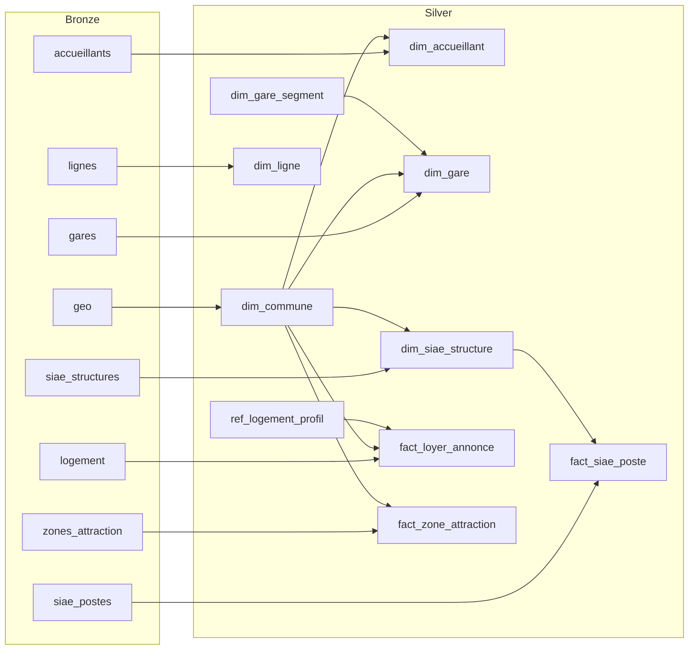

# DBT and pipeline inventory (Odace)

Silver and gold transformations may run in a **DBT** project (in another repo or previously in-repo `dbt/`). The app runs bronze (Python) and can trigger `dbt run` for silver/gold when a dbt project is present. This document describes the pipeline inventory, dependency graph, and config.

## Pipeline inventory

### Bronze (8 pipelines)

| Table            | Source                    | Config |
|-----------------|---------------------------|--------|
| geo             | S3 `raw/geo`              | [config/pipelines/bronze.yaml](../config/pipelines/bronze.yaml) |
| accueillants    | S3 `raw/accueillants`     | same   |
| logement        | S3 `raw/logement`         | same   |
| zones_attraction| S3 `raw/zones_attraction` | same   |
| gares           | S3 `raw/transport/gares` | same   |
| lignes          | API Open Data             | same   |
| siae_structures | API emplois.inclusion     | same   |
| siae_postes     | API emplois.inclusion     | same   |

Bronze ingestion is implemented in Python (`app/pipelines/bronze/`): file-based (S3) or API-based. In a DBT setup, bronze tables are populated by this app; DBT would reference them as **sources** (e.g. via `DBT_S3_PATH` / bronze path).

### Silver (10 pipelines)

| Table              | Target table          | Dependencies |
|--------------------|----------------------|--------------|
| dim_commune        | dim_commune          | bronze.geo   |
| dim_accueillant    | dim_accueillant      | bronze.accueillants, silver.dim_commune |
| dim_gare_segment   | dim_gare_segment     | (none)       |
| dim_gare           | dim_gare             | bronze.gares, silver.dim_commune, silver.dim_gare_segment |
| dim_ligne          | dim_ligne            | bronze.lignes |
| dim_siae_structure | dim_siae_structure   | bronze.siae_structures, silver.dim_commune |
| ref_logement_profil| ref_logement_profil  | (none)       |
| fact_loyer_annonce | fact_loyer_annonce   | bronze.logement, silver.dim_commune, silver.ref_logement_profil |
| fact_zone_attraction | fact_zone_attraction | bronze.zones_attraction, silver.dim_commune |
| fact_siae_poste   | fact_siae_poste      | bronze.siae_postes, silver.dim_siae_structure |

Silver models live in `dbt/models/silver/`. Reference: [config/pipelines/silver.yaml](../config/pipelines/silver.yaml).

### Gold

Empty. [config/pipelines/gold.yaml](../config/pipelines/gold.yaml) has `pipelines: []`.

---

## Dependency graph (silver)

Silver models depend on bronze and other silver models. This matches the YAML `dependencies` and will become dbt `ref()` and `source()`.

Execution order used today (and by dbt): `dim_commune`, `dim_gare_segment`, `ref_logement_profil` first (no or minimal deps), then `dim_accueillant`, `dim_gare`, `dim_ligne`, `dim_siae_structure`, then `fact_loyer_annonce`, `fact_zone_attraction`, `fact_siae_poste`.

---

## Where SQL lives

- **Silver/Gold**: In your DBT project (e.g. `models/silver/`, `models/gold/`). Staging views read bronze Delta tables from S3. The app can trigger `dbt run` via `app/core/dbt_runner.py` when a dbt project exists in the repo.
- **Bronze**: In Python (`app/pipelines/bronze/`); DBT reads bronze as sources (S3 paths set via `DBT_S3_PATH` or app settings).

---

## Config to reuse

Keep these in sync; they will feed dbt schema and sources:

- **[config/data_catalogue.yaml](../config/data_catalogue.yaml)** — Table and field descriptions for the silver layer. Use for dbt `schema.yml` (columns, tests, docs).
- **[config/pipelines/silver.yaml](../config/pipelines/silver.yaml)** — Model names, `dependencies`, `description_fr`. Use for dbt model names and `ref()` / documentation.
- **[config/pipelines/bronze.yaml](../config/pipelines/bronze.yaml)** — Bronze table names and source paths. Use for dbt `sources.yml`.

---

## Bronze vs Silver/Gold in DBT

- **Bronze**: Ingestion (S3 files, APIs) stays in Python. DBT reads from bronze as **sources** (S3/Delta paths).
- **Silver and Gold**: Implement as dbt models. Silver models read from bronze sources and other silver models via `ref()`. Gold models (when added) read from silver with `ref()`.

See [pipelines.md](pipelines.md) for how to run pipelines (API and scripts).
