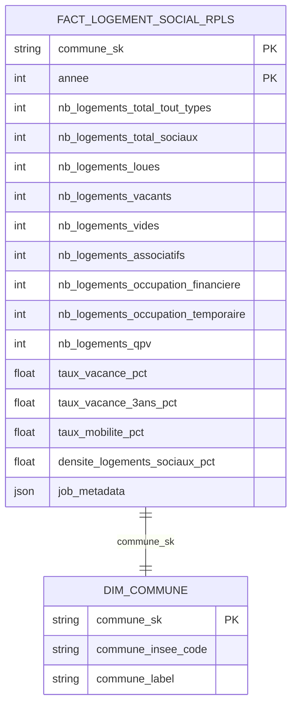

# Modélisation - Logements Sociaux RPLS

**Source** : [Données RPLS sur statistiques.developpement-durable.gouv.fr](https://www.statistiques.developpement-durable.gouv.fr//media/7970/download?inline)
**Date** : 2026-05-06

---

## Structure du fichier source

**Fichier** : `raw_download/raw/logement/social/resultats_rpls_2024_v4.xlsx`

Le fichier contient 6 onglets :

| Onglet | Contenu | Utilisé |
|---|---|---|
| `INFORMATIONS` | Métadonnées de la publication | Non |
| `REGION` | Statistiques agrégées par région (33 lignes) | Non |
| `DEPARTEMENT` | Statistiques agrégées par département (102 lignes) | Non |
| `EPCI` | Statistiques agrégées par EPCI (1 332 lignes) | Non |
| **`COMMUNES`** | **Statistiques par commune (16 859 lignes)** | **Oui** |
| `CORRESPONDANCES FINANCEMENTS` | Table de correspondance des codes financement | Non |

### Structure de l'onglet COMMUNES

L'onglet a une structure d'en-têtes multi-niveaux inhabituelle :

```
Row 1 : groupes thématiques ("Ensemble du parc", "Evolution du parc", …)
Row 2 : sous-groupes ("Répartition par mode", "Vacances et mobilité", …)
Row 3 : libellés détaillés ("proposés à la location", "vides", …)
Row 4 : libellés visuels de colonnes ("Région", "Département", "Commune", …)
Row 5 : (vide)
Row 6 : noms techniques des colonnes  ← header réel à utiliser
Row 7+ : données
```

À l'ingestion, il faut sauter les 5 premières lignes pour atteindre les noms techniques :

```python
pd.read_excel(..., sheet_name='COMMUNES', skiprows=5)
# ou équivalent : header=5
```

### Colonne identifiant commune : `DEPCOM_ARM`

- Type : **string 5 caractères**, zéros initiaux préservés (ex. `'01001'`, `'13055'`, `'75056'`)
- Contient les codes communes **et** les codes arrondissements (Paris `751xx`, Lyon `693xx`, Marseille `132xx`)
- Les colonnes `REG` (code région, entier) et `DEP` (code département, entier sans zéro initial) sont disponibles pour filtrage mais ne sont pas promues en colonnes silver

### Colonnes techniques disponibles (extrait)

| Colonne source | Type | Description |
|---|---|---|
| `DEPCOM_ARM` | string 5 chars | Code INSEE commune ou arrondissement |
| `LIBCOM` | string | Libellé de la commune |
| `LIBCOM_DEP` | string | Libellé avec département (ex. `"Ambérieu-en-Bugey (01)"`) |
| `REG` | int | Code région (filtrage uniquement) |
| `DEP` | int | Code département sans zéro initial (filtrage uniquement) |
| `nb_ls` | int | Nb logements sociaux (parc locatif social) |
| `nb_lgt_tot` | int | Nb total logements tous types |
| `nb_loues` | int | Nb logements loués |
| `nb_vacants` | int | Nb logements vacants |
| `nb_vides` | int | Nb logements vides |
| `nb_asso` | int | Nb logements gérés par des associations |
| `nb_occup_finan` | int | Nb logements en occupation financière |
| `nb_occup_temp` | int | Nb logements en occupation temporaire |
| `nb_ls_en_qpv` | int | Nb logements sociaux en QPV |
| `tx_vac` | float | Taux de vacance % |
| `tx_vac3` | float | Taux de vacance structurelle >3 ans % |
| `tx_mob` | float | Taux de mobilité % |
| `densite` | float | Densité pour 100 résidences principales |

---

## Table : FACT_LOGEMENT_SOCIAL_RPLS

Table de faits consolidant les statistiques sur les logements sociaux (Répertoire des logements locatifs des bailleurs sociaux - RPLS) à la maille de la commune et du millésime annuel.

### Mapping Bronze → Silver

| Colonne cible | Transformation | Champ source | Description |
|---------------|----------------|--------------|-------------|
| **Clés et identifiants** ||||
| `commune_sk` | `md5(code_insee_norm)` | `DEPCOM_ARM` | Clé technique après normalisation du code INSEE et remontée des arrondissements vers la commune parente. Voir note ci-dessous. |
| `annee` | `regexp_extract(source_filename, '(\d{4})', 1)` | `source_filename` | Millésime RPLS extrait du nom de fichier source (ex. `resultats_rpls_2024_v4.xlsx` → `2024`). Clé de déduplication temporelle avec `commune_sk`. |
| **Indicateurs de volume** ||||
| `nb_logements_total_tout_types` | Directe | `nb_lgt_tot` | Nombre total de logements (tous types confondus). |
| `nb_logements_total_sociaux` | Directe | `nb_ls` | Nombre total de logements sociaux (parc locatif social). |
| `nb_logements_loues` | Directe | `nb_loues` | Nombre de logements sociaux loués. |
| `nb_logements_vacants` | Directe | `nb_vacants` | Nombre de logements sociaux vacants. |
| `nb_logements_vides` | Directe | `nb_vides` | Nombre de logements sociaux vides. |
| `nb_logements_associatifs` | Directe | `nb_asso` | Nombre de logements sociaux gérés par des associations. |
| `nb_logements_occupation_financiere` | Directe | `nb_occup_finan` | Nombre de logements sociaux en occupation avec aide/participation financière. |
| `nb_logements_occupation_temporaire` | Directe | `nb_occup_temp` | Nombre de logements sociaux en occupation temporaire. |
| `nb_logements_qpv` | Directe | `nb_ls_en_qpv` | Nombre de logements sociaux situés en Quartiers Prioritaires de la Politique de la Ville (QPV). |
| **Indicateurs de taux et densité** ||||
| `taux_vacance_pct` | Directe | `tx_vac` | Taux de vacance dans le parc locatif social. |
| `taux_vacance_3ans_pct` | Directe | `tx_vac3` | Taux de vacance structurelle (plus de 3 ans) dans le parc locatif social. |
| `taux_mobilite_pct` | Directe | `tx_mob` | Taux de mobilité (rotation) dans le parc locatif social. |
| `densite_logements_sociaux_pct` | Directe | `densite` | Densité des logements sociaux par rapport au parc total. |
| **Métadonnées** ||||
| `job_metadata` | `json_object(...)` | - | JSON contenant `job_insert_id`, `job_insert_date_utc`, `job_modify_id`, `job_modify_date_utc`, `ingestion_timestamp`. Conforme au pattern de toutes les tables silver. |

---

## Notes d'implémentation

### Clé primaire composite `(commune_sk, annee)`

Le RPLS étant un millésime annuel, la granularité est `(commune, année)`. La déduplication est donc `partition by commune_sk, annee order by ingestion_timestamp desc`. Cela permet de charger plusieurs millésimes (`2023`, `2024`, …) dans la même table sans collision.

### Extraction de l'année depuis le nom de fichier

Le bronze hérite d'une colonne `source_filename` (ajoutée par `ingest_raw_to_bronze_s3.py`). L'année est extraite via `regexp_extract(source_filename, '(\d{4})', 1)`, ce qui donne `2024` pour `resultats_rpls_2024_v4.xlsx`.

### Normalisation de `DEPCOM_ARM` et remontée des arrondissements

La colonne source `DEPCOM_ARM` contient déjà des strings 5 caractères avec zéros initiaux préservés. Elle inclut nativement les codes d'arrondissement pour Paris, Lyon et Marseille, qui doivent être remontés vers le code commune parent avant la jointure sur `dim_commune` :

```sql
case
    when DEPCOM_ARM like '132%' then '13055'  -- arrondissements de Marseille
    when DEPCOM_ARM like '693%' then '69123'  -- arrondissements de Lyon
    when DEPCOM_ARM like '751%' then '75056'  -- arrondissements de Paris
    else DEPCOM_ARM
end as code_insee_norm
```

Ce pattern est identique à celui de `fact_loyer_annonce`. La `commune_sk` est ensuite calculée : `md5(code_insee_norm)`.

### Colonnes `REG` et `DEP` disponibles pour filtrage

Les colonnes `REG` (code région, entier) et `DEP` (code département, entier sans zéro initial — ex. `1` pour `01`) sont disponibles dans le bronze. Elles ne sont pas promues en silver car `dim_commune` porte déjà `departement_code` et `region_code`. Si un filtrage géographique est nécessaire dans le modèle silver, on peut les utiliser en CTE amont via `lpad(cast(DEP as varchar), 2, '0')`.

### Métadonnées `job_metadata`

Stockées dans une seule colonne JSON, conforme aux modèles silver existants (`fact_loyer_annonce`, `fact_siae_poste`, `dim_accueillant`, etc.) :

```sql
json_object(
    'job_insert_id',       'fact_logement_social_rpls',
    'job_insert_date_utc', current_timestamp,
    'job_modify_id',       'fact_logement_social_rpls',
    'job_modify_date_utc', current_timestamp,
    'ingestion_timestamp', ingestion_timestamp
) as job_metadata
```

### Règles de nommage respectées

- ✅ Les notions métier sont en français, sans abréviations (`associatifs`, `occupation_temporaire`, `taux_vacance`).
- ✅ Les indications statistiques (`nb`, `pct`) sont en adéquation avec les règles (préfixes pour les entiers isolés, suffixes sinon).
- ✅ Table préfixée par `fact_` pour des données analytiques de comptages/taux.
- ✅ Métadonnées dans une colonne `job_metadata` JSON (conforme aux conventions silver).
- ✅ Clé composite `(commune_sk, annee)` pour supporter les millésimes multiples.

---

---

## Millésimes disponibles

Tous hébergés sur [statistiques.developpement-durable.gouv.fr](https://www.statistiques.developpement-durable.gouv.fr).

| Année | URL source | Nom de fichier | Format | Taille | Statut |
|---|---|---|---|---|---|
| 2025 | — | — | — | — | Publication du 20/01/2026, xlsx non encore mis en ligne |
| **2024** | [media/7970](https://www.statistiques.developpement-durable.gouv.fr/media/7970/download) | `resultats_rpls_2024_v4.xlsx` | xlsx | 31,6 Mo | Disponible |
| **2023** | [media/6897](https://www.statistiques.developpement-durable.gouv.fr/media/6897/download) | `rpls_2023_resultats.xlsx` | xlsx | 19,7 Mo | Disponible |
| **2022** | [media/6006](https://www.statistiques.developpement-durable.gouv.fr/media/6006/download) | `resultats_rpls_2022.xlsx` | xlsx | 20,0 Mo | Disponible |
| **2021** | [media/4997](https://www.statistiques.developpement-durable.gouv.fr/media/4997/download) | `resultats_rpls_2021_0.xlsx` | xlsx | 19,8 Mo | Disponible |
| **2020** | [media/4096](https://www.statistiques.developpement-durable.gouv.fr/media/4096/download) | `resultats_rpls_2020_0.xlsx` | xlsx | 18,6 Mo | Disponible |
| 2019 | [media/3404](https://www.statistiques.developpement-durable.gouv.fr/media/3404/download) | `resultats-rpls-2019.xls` | xls | 23,7 Mo | Hors périmètre (format `.xls` non encore validé) |
| ≤ 2018 | — | — | — | — | Hors périmètre — données communales partielles (seulement `nb_ls`, pas de taux) |

Le périmètre retenu pour le pipeline est **2020–2024** : format `.xlsx` uniforme, onglet `COMMUNES` identique, toutes les colonnes de la FACT table présentes.

**Rupture de série 2023** : les méthodes d'imputation des loyers ont été revues en 2023. Cela n'impacte pas les colonnes de la FACT table (`nb_*`, `tx_vac`, `tx_mob`, `densite`) mais peut créer des discontinuités dans les séries historiques.

---

## Pipeline d'ingestion

```
SDES website                  local                    S3 Scaleway              dbt (DuckDB)
media/xxxx/download  →  raw_download/raw/       →  raw/logement_social/  →  bronze_logement_social (view)
                         logement/social/            bronze/logement_social/      │
                         resultats_rpls_YYYY.xlsx        (Delta)             fact_logement_social_rpls
                                                                              (external Parquet)
```

### Commandes

```bash
# 1. Télécharger les xlsx (idempotent : skip si déjà présent localement)
python3 bin/download_rpls_xlsx.py --annee all

# 2. Uploader vers S3 raw/ (idempotent : skip si déjà présent sur S3)
python3 bin/upload_raw_download_to_s3.py --skip-existing

# 3. Ingérer vers bronze/ (Delta overwrite complet)
python3 bin/ingest_raw_to_bronze_s3.py --table logement_social

# 4. Construire le modèle silver
cd dbt_odis_odace && dbt run --select fact_logement_social_rpls
```

### Idempotence par étape

| Étape | Mécanisme |
|---|---|
| Téléchargement xlsx | `os.path.exists(dest)` + taille > 1 Mo → skip |
| Upload S3 | `head_object` → skip si clé déjà présente (option `--skip-existing`) |
| Ingestion bronze | `delete_prefix` + `write_deltalake overwrite` — toujours full refresh |
| Silver dbt | External Parquet overwrite — toujours recalculé |
| Déduplication | `row_number() partition by (commune_sk, annee)` — un enregistrement par commune × millésime |

---

## Diagramme de relations


